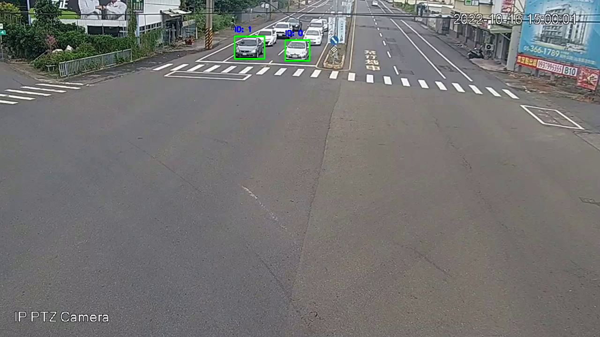
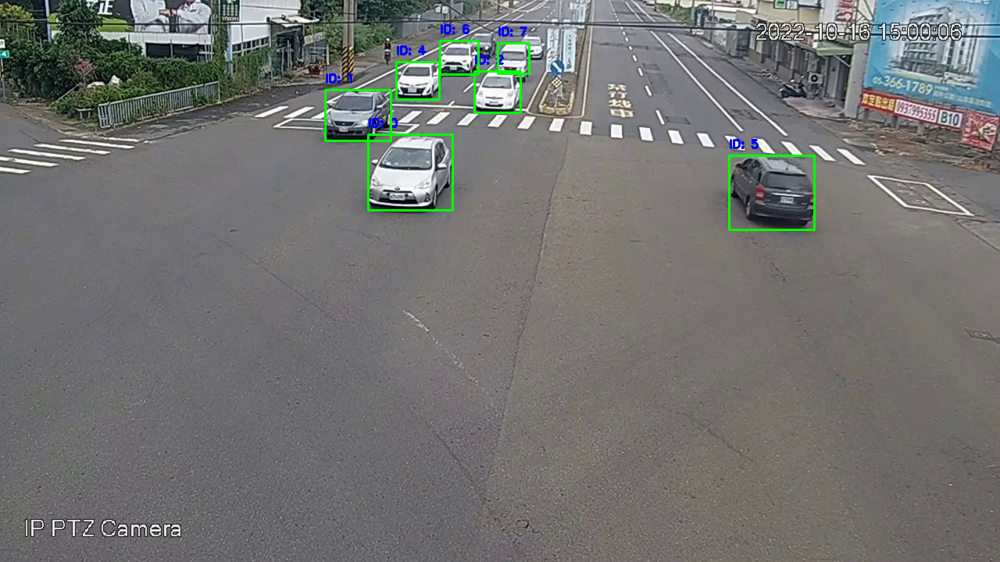

# AICUP 跨相機多目標車輛追蹤競賽（模型組）
## 介紹
比賽目標通過對道路車輛進行偵測，並進行跨相機車輛追蹤，並賦予車輛編號。\
使用 [YOLOv7](https://github.com/WongKinYiu/yolov7) 模型進行車輛偵測，[CLIP ReID](https://github.com/Syliz517/CLIP-ReID) 模型進行跨相機車輛追蹤。[比賽連結](https://tbrain.trendmicro.com.tw/Competitions/Details/33)

|||
|------------------------|------------------------|

1. **隊伍**: TEAM_4944
2. **隊員**: 胡太維 (隊長)
3. **最終排名**: 9 (共 286 隊)
4. **Private leaderboard**: 1.136904

## 軟硬體設定
1. **操作系統**： Linux-64
2. **硬體**： 
   + CPU: 12 核心 Intel(R) Xeon(R) CPU @ 2.20GHz
   + GPU: Nvidia L4 (23 GB)
3. **Python 版本**: 3.10.12
4. **CUDA 版本**: 12.2


## 安裝
1. **YOLOv7 環境**
   ```bash
   python -m venv yolov7-env
   source yolov7-env/bin/activate
   pip install -r yolov7/requirements.txt
   ```

2. **ReID 環境**
   ```bash
   python -m venv reid-env
   source reid-env/bin/activate
   pip install -r requirements.txt
   ```

## 前期準備
1. **[資料下載](https://drive.google.com/drive/folders/1MiOspGNUrnVxB7yqPK3F8F3ViQhlFj70?usp=drive_link)**：請將資料進行解壓縮，放置於 `data/` 資料夾中。
   | 檔案名稱 | 說明 |
   |:-------------|:--------------:|
   | [train.zip]()         |   原始訓練資料    |
   | [32_33_AI_CUP_testdataset.zip]()   |   原始測試資料      |
   | [final.zip]()  |   處理後訓練資料 (已將原始訓練影像車輛擷取，並進行 train, query, gallery 分割)  |

   ```plaintext
   data/
   ├── final/
   |   ├── train.csv
   |   ├── query.csv
   |   ├── gallery.csv
   |   └── images_3/
   |       ├── 0.jpg
   |       ├── 1.jpg
   |       └── ...
   ├── train/
   |   ├── images/
   |   └── labels/
   └── 32_33_AI_CUP_testdataset/AI_CUP_testdata
       └── images/
   ```


2. **[模型權重下載](https://drive.google.com/drive/folders/19wHyB9UdzuuNAtoBgWUND-QArb3he1pj?usp=drive_link)**：放置於 `weight/` 資料夾中。

   | 檔案名稱 | 說明 |
   |:-------------|:--------------:|
   | [yolov7x.pt]()                   |   YOLOv7x COCO 資料集預訓練       |
   | [yolov7x_best.pt]()              |   YOLOv7x 比賽資料集訓練          |
   | [VehicleID_clipreid_12x12sie_ViT-B-16_60.pt]()  |   CLIP_ReID VehicleID 資料集預訓練  |
   | [final_reid_model_e59.pt]()  |   CLIP_ReID 比賽資料集訓練  |

   ```plaintext
   weight/
   ├── yolov7x.pt
   ├── yolov7x_best.pt
   ├── VehicleID_clipreid_12x12sie_ViT-B-16_60.pt  
   └── final_reid_model_e59.pt
   ```


## 模型訓練
1. **訓練車輛偵測模型**
   ```bash
   # Virtual Environment: yolov7-env
   cd yolov7
   python train.py --workers 8 \
                   --device 0 \
                   --batch-size 32 \
                   --data data/custom.yaml \
                   --img 640 640 \
                   --cfg cfg/training/yolov7.yaml \
                   --weights /content/yolov7/weights/yolov7x.pt \
                   --name yolov7 \
                   --hyp data/hyp.scratch.p5.yaml \
                   --epochs 20
   ```

2. **訓練車輛辨識模型**
   ```bash
   # Virtual Environment: reid-env
   python tools/train.py --tag AICUP_ReID \
                         --config_file configs/train/v1.yaml \
                         --train_csv data/final/train.csv \
                         --query_csv data/final/query.csv \
                         --gallery data/final/gallery.csv \
                         --image_dir data/final/images_3 \
                         --batch_size 96 \
                         --num_workers 8 \
                         --device cuda
   ```


## 跨相機車輛匹配
1. **測試集車輛偵測**
   ```bash
   # Virtual Environment: yolov7-env
   cd yolov7
   python detect.py --weights weights/yolov7x_best.pt \
                    --source "data/32_33_AI_CUP_testdataset/AI_CUP_testdata/images/*/*.jpg" \
                    --save_dir data \
                    --device 0 \
                    --conf-thres 0.2 \
                    --img-size 640 \
                    --nosave
   ```

2. **儲存擷取車輛影像**
   ```bash
   # Virtual Environment: reid-env
   python tools/crop_vehicles.py --csv_path data/test_result.csv \
                                 --save_dir data/test_images \
                                 --margin 3
   ```

3. **產車輛影像的 Embedding**
   ```bash
   # Virtual Environment: reid-env
   python tools/make_feat.py --csv_path data/test_result.csv \
                             --ckpt weight/final_reid_model_e59.pt \
                             --image_dir data/test_images \
                             --save_dir data/test_feat \
                             --batch_size 128
   ```

4. **車輛匹配**
   ```bash
   # Virtual Environment: reid-env
   python tools/assign_vid.py --csv_path data/test_result.csv \
                              --feat_dir data/test_feat \
                              --save_path data/test_result.json \
                              --pre 3 \
                              --metric cosine_distances \
                              --topk 1000 \
                              --margin_cfg configs/margin_v5.json
   ```

5. **轉換為比賽提交格式**
   ```bash
   # Virtual Environment: reid-env
   python tools/convert_to_submit.py --csv_path data/test_result.csv \
                                    --json_path data/test_result.json \
                                    --save_dir data/submit \
                                    --image_dir data/32_33_AI_CUP_testdataset/AI_CUP_testdata/images
   ```